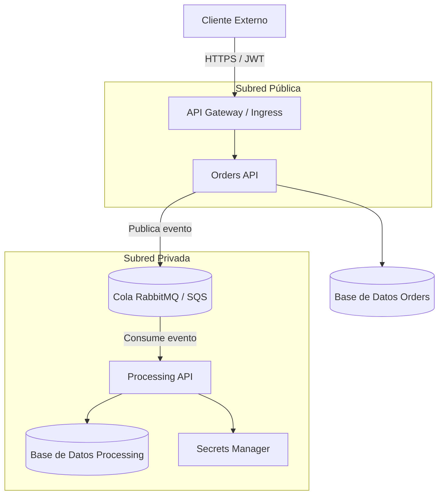

# Registro de Decisiones y Respuestas Técnicas

**Nombre del Candidato:** [Vladimir Rodriguez Londoño]  
**Fecha:** [13/08/2026]  
**Enlace al Video de Sustentación (Loom/Drive):** https://drive.google.com/file/d/1pvI_xfnWS800Pa32odkUOwZjRYJhu7Fx/view?usp=drive_link

---

## 1. Gestión del Tiempo y Priorización

> *Describe brevemente cómo organizaste las 3.5 horas de la prueba. ¿A qué tareas le diste prioridad absoluta y qué elementos tuviste que simplificar o dejar pendientes por limitación de tiempo?*

**Respuesta:**

Organicé las 3.5 horas siguiendo el orden natural de dependencias entre tareas, validando cada paso antes de avanzar al siguiente:

- **25 min:** configuré el ambiente local para ejecutar la API de Python, probándola con Postman y asegurándome de que no tuviera errores antes de construir nada sobre ella.
- **15 min:** creé el repositorio en Git y lo cloné en mi máquina local (tomó más de lo esperado por un tema de permisos de acceso).
- **30 min:** construí el Dockerfile (imagen liviana, usuario non-root, variables de entorno, dependencias). Verifiqué la imagen corriéndola localmente con `docker run --rm -p 8080:8080 orders-api:1.0` y confirmé en el navegador que respondía igual que en Postman.
- **10 min:** creé el `configmap.yaml` con las variables de entorno.
- **20 min:** creé el `deployment.yaml` (2 réplicas) y verifiqué con comandos de `kubectl` que los pods quedaran corriendo correctamente.
- **20 min:** creé el `service.yaml` (ClusterIP) y validé que el servicio apuntara bien al puerto de los pods.
- **30 min:** construí el pipeline de CI/CD completo (lint/test con prueba unitaria, security scan con Trivy, build & push con tag por SHA, y el stage de deploy simulado).
- **20 min:** documenté las decisiones y respuestas de arquitectura en este archivo (`DECISIONS.md`).
- **Tiempo restante (~40 min):** revisión general de que todo quedara funcionando, preparación de la exposición, grabación y envío del video.

**Priorización:** le di prioridad absoluta a tener en cada etapa algo *funcionando y verificado* antes de avanzar (por ejemplo, probar la imagen Docker corriendo localmente antes de pasar a Kubernetes, y validar los pods antes de crear el Service) — esto para evitar construir sobre una base rota y tener que retroceder. Con esa organización logré completar el alcance completo pedido en la prueba (Ejercicio 1, Ejercicio 2 con las 4 etapas del pipeline, y la Parte 2 de arquitectura) dentro de las 3.5 horas.

---

## 2. Ejercicio 3: Arquitectura de Microservicios

### A. Diagrama de Arquitectura
*Puedes usar sintaxis Mermaid.js (ejemplo abajo) o usar draw.io o insertar el enlace a una imagen dentro del repositorio.*

### B. Comunicación entre APIs
*¿Síncrona (REST) o Asíncrona (Eventos/Colas)? Justifica tu elección:

**Respuesta:**

Opté por comunicación **asíncrona mediante una cola de mensajes (RabbitMQ)**. La Orders API publica un evento (ej. `PedidoCreado`) en la cola y responde de inmediato al cliente, sin esperar a que el pago termine de procesarse. La Processing API consume ese evento de forma independiente.

Justificación: el procesamiento de pagos y notificaciones puede tardar (validaciones con pasarelas externas, reintentos, etc.). Si esa comunicación fuera síncrona (REST), la Orders API quedaría bloqueada esperando la respuesta, degradando la experiencia del cliente y acoplando la disponibilidad de una API a la otra. Con colas se logra:
- **Desacoplamiento:** Orders no necesita saber si Processing está disponible en ese instante.
- **Resiliencia:** si Processing falla momentáneamente, los mensajes quedan en la cola y se procesan al recuperarse, sin pérdida de pedidos.
- **Escalabilidad:** se pueden añadir más instancias de Processing para consumir la cola más rápido en picos de demanda.

Ya he implementado este patrón con RabbitMQ en producción, por lo que la elección se basa en experiencia previa con la herramienta, no solo en teoría.

### C. Seguridad y Red
*¿Cómo garantizas que la Processing API sea completamente privada? ¿Cómo autenticas al cliente en la Orders API?*

**Respuesta:**

**Aislamiento de red:** despliego la Processing API en una **subred privada** (sin IP pública ni ruta a un Internet Gateway), dentro de la misma VPC que la Orders API. Los **Security Groups**/**NetworkPolicies** solo permiten tráfico entrante hacia Processing desde el Security Group de Orders API (o desde el broker de mensajería), bloqueando cualquier otro origen. En Kubernetes, esto se refuerza exponiendo Processing únicamente como un **Service tipo ClusterIP** (nunca LoadBalancer ni NodePort) y aplicando una **NetworkPolicy** que restrinja qué pods pueden conectarse a él.

**Autenticación del cliente en Orders API:** uso **OAuth2/JWT**. El cliente se autentica contra un proveedor de identidad (ej. AWS Cognito, Auth0 o un Identity Server propio) y obtiene un token JWT firmado. Cada petición a la Orders API incluye ese token en el header `Authorization`, y la API valida firma, expiración y claims antes de procesar la solicitud.

### D. Infraestructura Cloud / Kubernetes
*¿Qué componentes de red, cómputo, base de datos y gestión de secretos utilizarías?*

**Respuesta:**

- **Red:** VPC con subred pública (Orders API + API Gateway/Load Balancer) y subred privada (Processing API, base de datos, broker de mensajería).
- **Cómputo:** contenedores Docker orquestados en Kubernetes (EKS), con Deployments separados para cada microservicio, liveness/readiness probes y HPA (autoescalado horizontal) para Processing en picos de carga.
- **Base de datos:** RDS (SQL) en subred privada, sin acceso público, una instancia/esquema por microservicio para mantener el aislamiento de datos.
- **Mensajería:** RabbitMQ (auto-gestionado o Amazon MQ) como broker entre ambas APIs.
- **Gestión de secretos:** credenciales de base de datos, API keys y strings de conexión almacenados en **AWS Secrets Manager** (o Kubernetes Secrets con cifrado en reposo), nunca en variables de entorno planas ni en el código fuente.

---

## 3. Preguntas de Criterio Técnico

### Estrategias de Branching: GitFlow vs Trunk-Based Development

**Respuesta:**

**GitFlow** trabaja con múltiples ramas de larga duración (`develop`, `release/*`, `hotfix/*`, `feature/*`), lo que da mucho control sobre qué entra en cada versión, pero implica más overhead de merges y ciclos de integración más lentos.

**Trunk-Based Development** se basa en una sola rama principal (`main`/`trunk`), con cambios pequeños e integraciones frecuentes (varias veces al día), apoyado en pipelines de CI robustos y, si es necesario, feature flags para ocultar funcionalidad incompleta.

**Para un entorno de CI/CD de alta frecuencia recomiendo Trunk-Based Development**, porque reduce el tiempo entre que se escribe código y se integra/despliega, minimiza conflictos de merge grandes, y se alinea directamente con el objetivo de despliegues continuos. GitFlow, con sus ramas de larga vida, introduce fricción que va en contra de esa velocidad.

### Troubleshooting en Kubernetes

*Si un microservicio en producción empieza a responder de forma lenta e intermitente, ¿cuáles son los 3 primeros comandos o métricas que revisarías?*

**Respuesta:**

1. **`kubectl top pod` / `kubectl top node`** — para descartar saturación de CPU o memoria (throttling o el pod acercándose a sus límites de recursos).
2. **`kubectl describe pod <pod>` y `kubectl logs <pod> --previous`** — para revisar eventos recientes (reinicios, OOMKilled, fallos de probes) y errores en la aplicación.
3. **`kubectl get pods -o wide` / estado de las readiness probes** — la lentitud "intermitente" suele deberse a que algunas réplicas están siendo sacadas y metidas del balanceo de tráfico por fallos de readiness, no a que todas estén lentas por igual; esto ayuda a confirmar si el problema es de un subconjunto de pods.